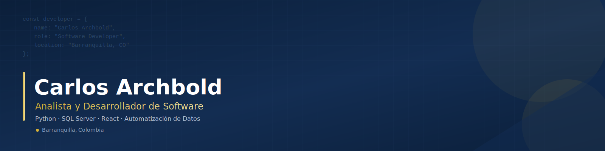
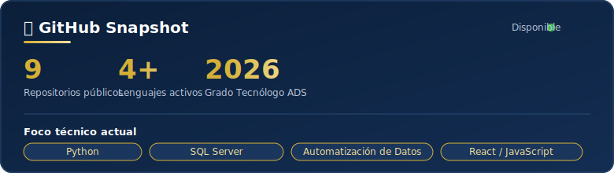

<!-- Banner Principal -->

 

<!-- Frase de propuesta de valor (con efecto de escritura) -->

  
  

---

## 🚀 Proyectos Destacados

<table>
  <tr>
    <td width="50%" valign="top">
      <h3>📋 Agentemotor — Gestión de Renovaciones</h3>
      
Sistema de portafolio para asesores de seguros que calcula en tiempo real la urgencia de renovación de pólizas dentro de la ventana regulatoria de 30 días exigida en el mercado colombiano, evitando la pérdida de clientes frente a la competencia.

      
      
      
        
      
    </td>
    <td width="50%" valign="top">
      <h3>🔍 Auditor de Calidad de Datos</h3>
      
Herramienta modular en Python compuesta por un generador de datos de prueba (limpios y defectuosos) y un auditor que valida columnas requeridas y campos vacíos, registrando resultados legibles en un log profesional.

      
      
        
      
    </td>
  </tr>
</table>

---

## 🛠️ Habilidades Técnicas

### **Backend & Automatización**

### **Frontend & Frameworks**

### **Herramientas & Sistemas Corporativos**

---

## 📊 GitHub Stats

  

  

---

## 👤 Acerca de mí

<table align="center" border="0">
  <tr>
    <td width="200" align="center" style="border: none;">
      
    </td>
    <td align="left" style="border: none; padding-left: 20px;">
      
Administrador de Empresas y Desarrollador Web con sólida formación técnica como Analista de Software. Me enfoco en la creación y mantenimiento de soluciones web robustas e innovadoras, especializándome en lógica backend, integración de bases de datos relacionales y la optimización de procesos de negocio mediante sistemas automáticos de monitoreo en tiempo real.

      
🎓 Administrador de Empresas | Tecnólogo en Análisis y Desarrollo de Software

      
<b>📍 Barranquilla, Colombia</b>

    </td>
  </tr>
</table>

